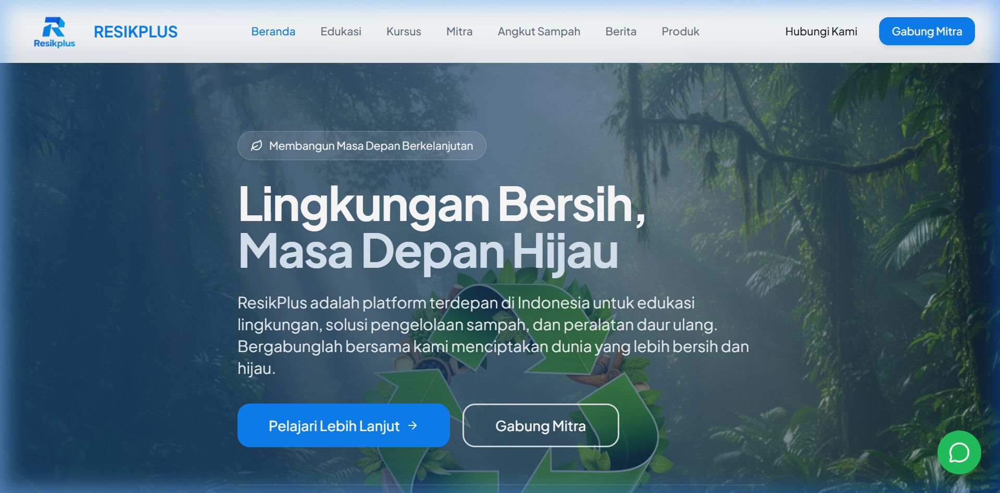

# ResikPlus - Solusi Kebersihan Lingkungan & Daur Ulang Indonesia



## 🌿 Tentang ResikPlus

**ResikPlus** adalah platform inovatif yang dirancang untuk mempercepat transisi Indonesia menuju ekonomi sirkular. Kami menyediakan ekosistem digital yang menghubungkan edukasi lingkungan, layanan pengelolaan sampah praktis, dan akses ke produk daur ulang berkualitas.

## ✨ Fitur Utama

### 1. Edukasi & Kursus Lingkungan
Platform kursus online yang komprehensif untuk individu dan organisasi guna mempelajari teknik pengelolaan sampah, kebijakan lingkungan, dan praktik daur ulang yang efektif.

### 2. Layanan Angkut Sampah
Sistem pemesanan dan manajemen pengangkutan sampah yang terintegrasi, memudahkan pengguna dalam memastikan sampah mereka dikelola dengan bertanggung jawab.

### 3. Katalog Produk Daur Ulang
Marketplace khusus untuk peralatan daur ulang dan produk hasil olahan sampah, mendukung industri kreatif berbasis limbah.

### 4. Dashboard Terpadu
- **Admin Dashboard**: Manajemen konten, pengguna, mitra, dan laporan analitik.
- **Customer Dashboard**: Pantau progres belajar, sertifikat, dan riwayat layanan.

## 🚀 Teknologi yang Digunakan

### Frontend
- **Framework**: [React.js](https://reactjs.org/) dengan [Vite](https://vitejs.dev/)
- **Bahasa**: [TypeScript](https://www.typescriptlang.org/)
- **Styling**: [Tailwind CSS](https://tailwindcss.com/) & [shadcn/ui](https://ui.shadcn.com/)
- **State Management**: [TanStack Query (React Query)](https://tanstack.com/query/latest)
- **Backend Service**: [Supabase](https://supabase.com/) (Auth, Database, Storage)

### Backend
- **Framework**: [Django](https://www.djangoproject.com/) (Python)
- **Database**: PostgreSQL (via Supabase)

## 📁 Struktur Direktori

```text
resikplus/
├── frontend/          # Aplikasi React (UI/UX)
├── backend/           # API Server & Logika Bisnis (Django)
├── screenshots/       # Dokumentasi visual aplikasi
└── ...
```

## 🛠️ Cara Menjalankan

### Frontend
```bash
cd frontend
npm install
npm run dev
```

### Backend
```bash
cd backend
python -m venv venv
# Aktifkan venv sesuai OS Anda
# Windows: venv\Scripts\activate
pip install -r requirements.txt
python manage.py runserver
```

---
Dibuat dengan ❤️ untuk lingkungan yang lebih baik.
